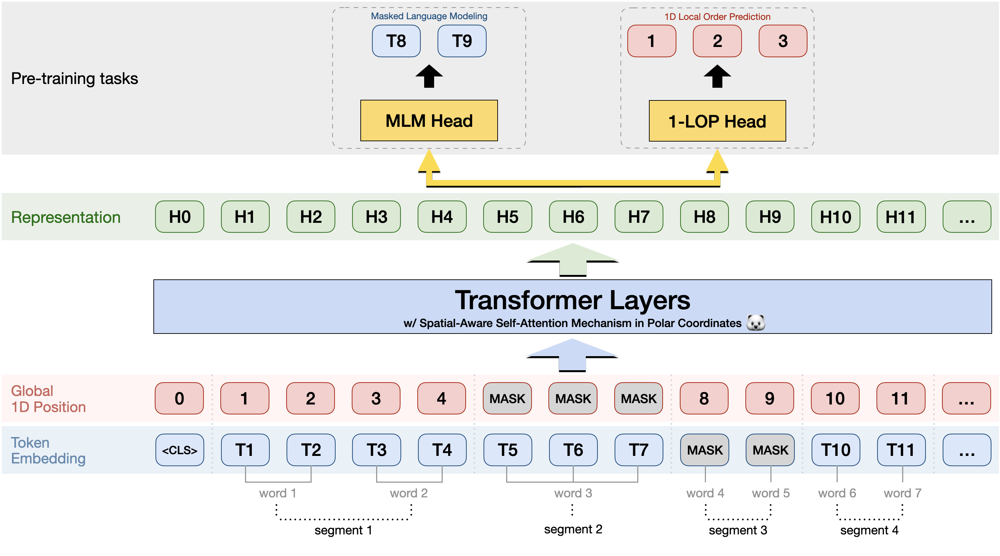

# DocPolarBERT

**Multimodal (Text + Layout) pre-training for Document AI**



## Introduction

DocPolarBERT is a multimodal pre-trained model that combines text and layout information for document understanding tasks. \
It is designed to enhance the performance of various Document AI applications by leveraging both textual content and spatial layout features.\
Notable differences with existing architectures include:
- **No absolute 2D positional encoding**: Instead, it uses relative positional encoding to capture the spatial relationships between text elements.
- **Self-attention with 2D Relative Positional Encoding in Polar Coordinates**: This allows the model to effectively process the layout of documents in a polar coordinate system, which is particularly useful for documents with complex layouts (invoices, financial documents, forms, etc.).
- **No vision feature**: The model does not rely on visual features extracted from images, focusing solely on text and layout information.

## Pre-trained Model

| Name           | Huggingface Link                                                                                     |
|----------------|------------------------------------------------------------------------------------------------------|
| DocPolarBERT   | [https://huggingface.co/buthaya/docpolarbert-base](https://huggingface.co/buthaya/docpolarbert-base) |


We pre-trained DocPolarBERT on a mix of 1.8M documents :
- Half are from the [Docile dataset](https://github.com/rossumai/docile),
- The other half are from the [OCR-IDL dataset](https://github.com/furkanbiten/idl_data).

*Why not use the IIT-CDIP dataset ?* \
&rarr; Because the IIT-CDIP documents  **do not come with layout annotations**.
Researchers usually run their own OCR on the images, and then pre-train their models.
This causes different versions of the same dataset to be used by different researchers, which makes it hard to compare results.
Instead, we use data that comes with publicly available layout annotations, so that we can ensure a fair comparison with other models.


The model is then fine-tuned and evaluated on :
- [FUNSD](https://guillaumejaume.github.io/FUNSD/), 
- [SROIE](https://rrc.cvc.uab.es/?ch=13), 
- [CORD (v2)](https://github.com/clovaai/cord), 
- [Docile's annotated-trainval set](https://github.com/rossumai/docile),
- Our own [Payslips dataset](https://github.com/buthaya/payslips).


## Citation

```
@misc{uthayasooriyar2025docpolarbertpretrainedmodeldocument,
      title={DocPolarBERT: A Pre-trained Model for Document Understanding with Relative Polar Coordinate Encoding of Layout Structures}, 
      author={Benno Uthayasooriyar and Antoine Ly and Franck Vermet and Caio Corro},
      year={2025},
      eprint={2507.08606},
      archivePrefix={arXiv},
      primaryClass={cs.CL},
      url={https://arxiv.org/abs/2507.08606}, 
}
```
## Contact
For help or issues using DocPolarBERT, please email [Benno Uthayasooriyar](https://github.com/buthaya) or submit a GitHub issue.

## License
This dataset is released under the MIT License. See [LICENSE](LICENSE) for details.

The license allows the commercial use, modification, distribution, and private use of the dataset, provided that the original copyright notice and this permission notice are included in all copies or substantial portions of the dataset.

The license does not provide any warranty, and the dataset is provided "as is".

The copyright notice and the permission notice shall be included in all copies or substantial portions of the dataset.